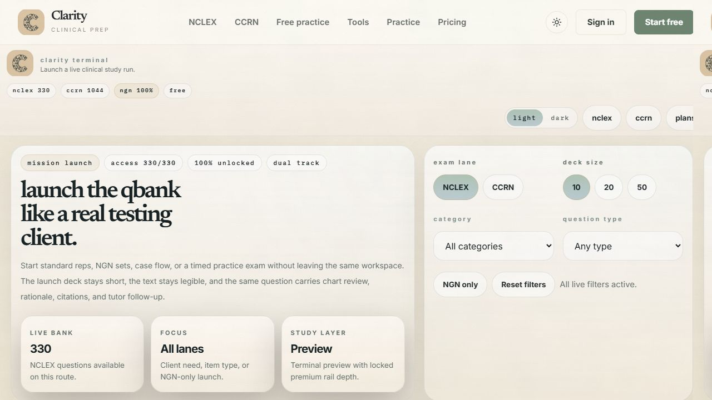
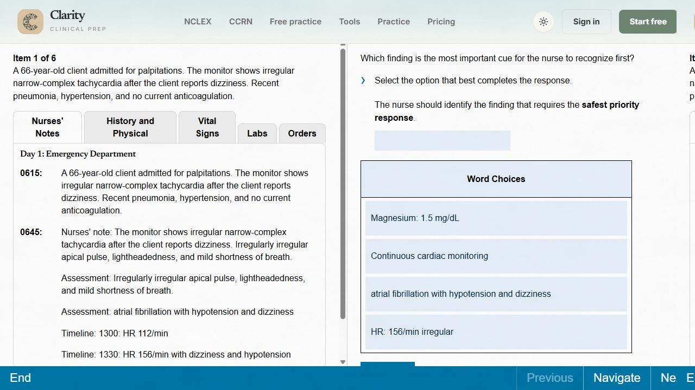
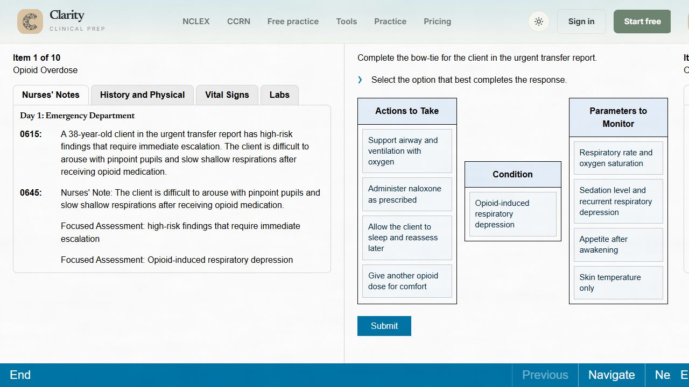

# P1 Staging Verification

Date: 2026-05-27

Staging URL: https://dev.chapaisolutions.com

## Checks

- P1 D1 migration applied idempotently to `chapai-staging`.
- P1 content sync upserted 330 rows: 300 case-study subitems and 30 bow-ties.
- `/api/quiz/start` returned one six-step case-study group with ordered CJMM steps.
- `/api/quiz/start` returned bow-tie items with one center condition, four action choices, and four monitoring choices.
- `/api/quiz/answer` returned bow-tie partial credit: center-only `1 / 5`, full correct `5 / 5`.
- Browser check confirmed `/quiz` reports `ngn 100%` for the staging P1-only NCLEX bank.

## Screenshots

